# System Design

## System Requirements

- user only able to see the tenant data that already assigned
- user able to see the performance of their chatbot

## Pre Requisite

- Generate RSA key ([ref](cmd/rsa/main.go))
- Create JWK ([ref](cmd/jwt/main.go))
- Register it to gooddata ([ref](cmd/registerjwk/registerjwk.go))
- Create Usergroup ([ref](cmd/usergroup/main.go))
- Assign permission to UserGroup

## System Architecture Diagram

```mermaid
sequenceDiagram
  autonumber

  participant fe as FE
  %% confirm which service who publish Tenant Creation Event
  participant ts as Tenancy Service
  participant ana as Analytics Service
  participant gd as GoodData

  ts-->>ana: [Pubsub] Tenant Creation Event
  ana->>+gd: Create User
  gd->>-ana: Response
  ana->>+gd: Add User to UserGroup
  gd->>-ana: Response
  ana->>+gd: Create User Data filter
  gd->>-ana: Response
  fe->>+ana: Request JWT Token
  ana->>-fe: Response
  fe->>+gd: Get Dashboard
  gd->>-fe: Response
```



## Task Detail

### BE

- create register JWT scripts [script](cmd/registerjwk/registerjwk.go) \*\*
  - before register JWT, need to generate RSA key [script](cmd/rsa/main.go) \*\*
- create register Usergroup and assign permission script [scripts](cmd/usergroup/main.go) \*\*
- create migration script for tenant that already created on Caas \*
- create gooddata API client [code](pkg/gooddata/)

  - user entitiy API
    - create user
  - set permission API
  - user data filter API
    - add user data filter
  - set JWK [ref](https://www.gooddata.com/docs/cloud/api-and-sdk/api/api_reference_all/#tag/JWKS)

- create pubsub client to listen tenant creation event
- create get jwt token API [logic ref](internal/usecases/token.go)

  - contract

  ```proto
  message GetTokenRequest {
    string tenant_id = 1;
  }

  message GetTokenResponse {
    string access_token = 1;
  }

  service AnalyticService {
    rpc GetToken(GetTokenRequest) returns (GetTokenResponse) {
      option (google.api.http) = {
        post: "/v1/analytics/token",
        body: "*",
      };
    }
  }
  ```

## Notes

- this is example how to show gooddata visualization using jwt ([ref](views/features/dashboard/Dashboard.tsx))
